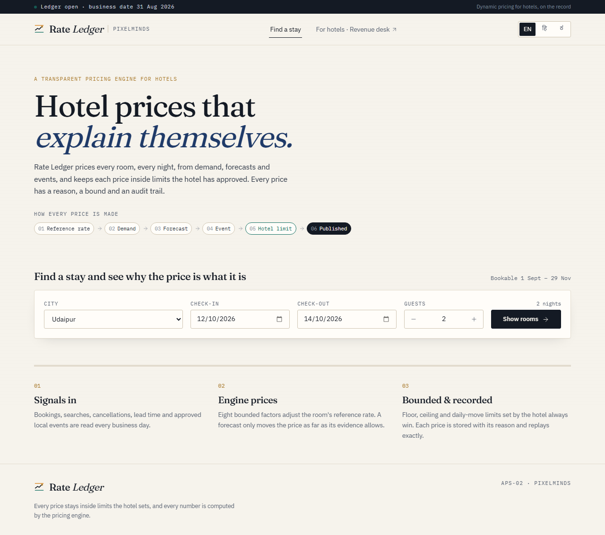
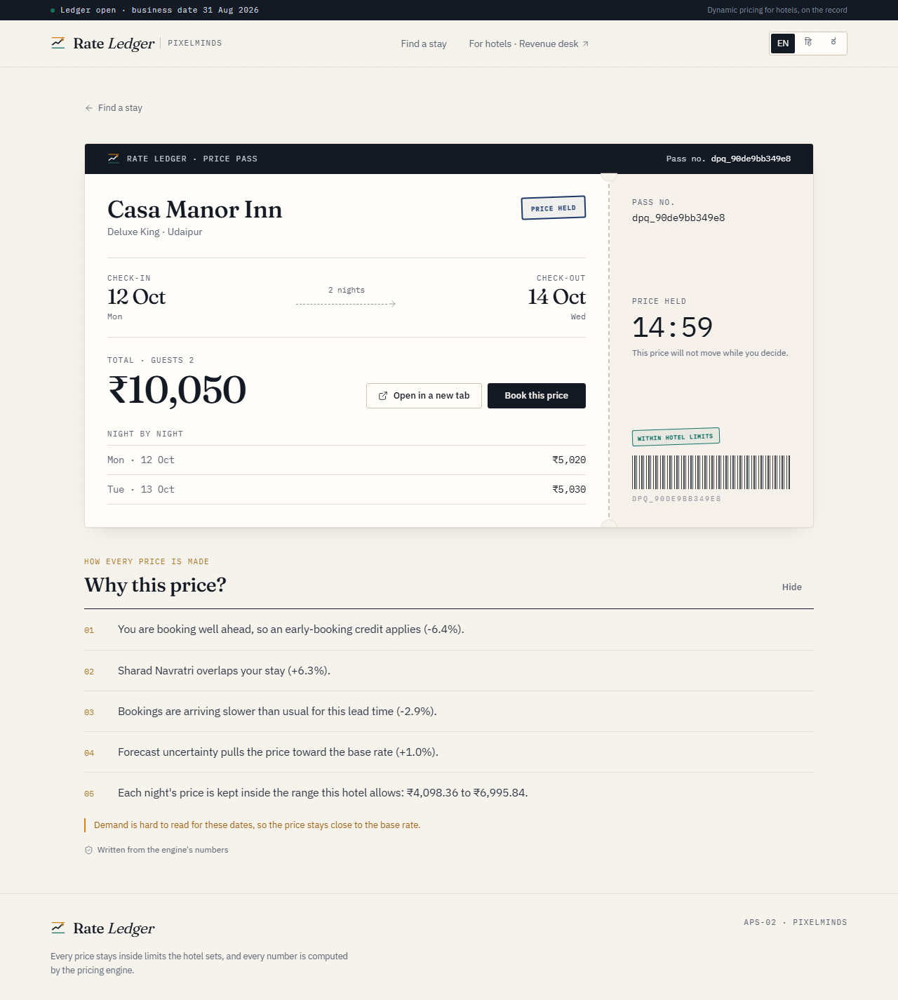
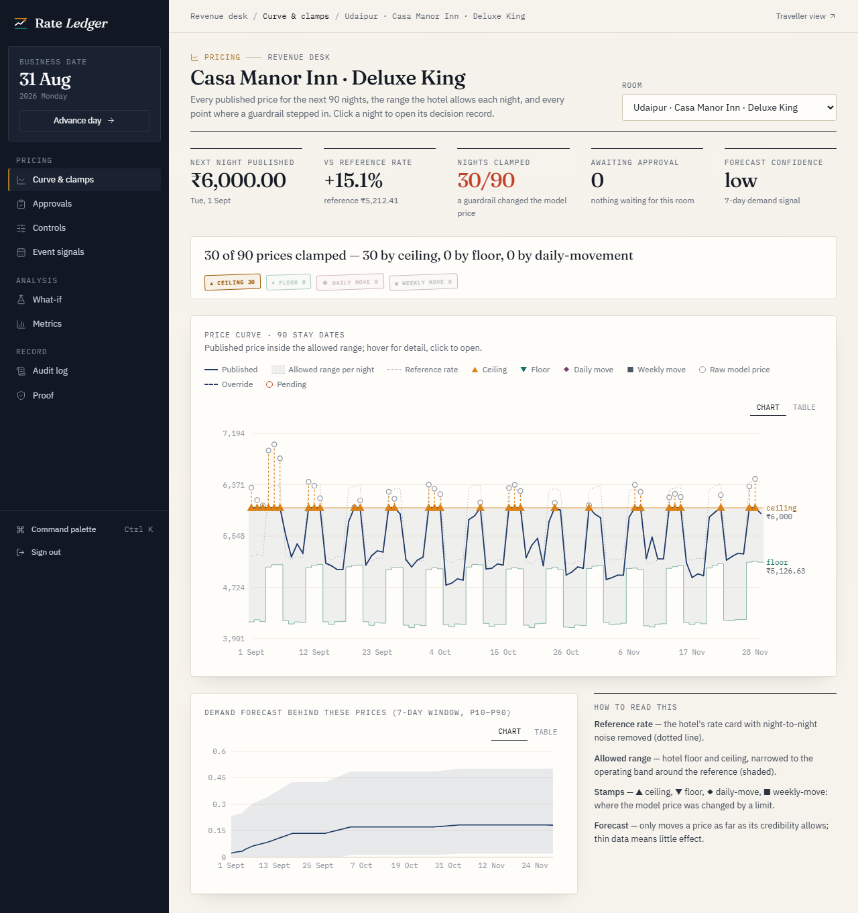
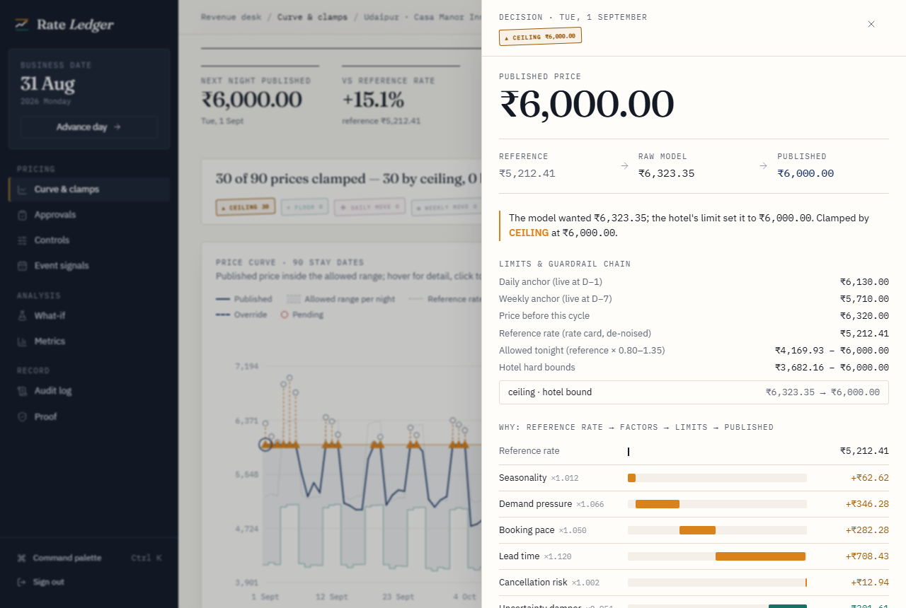
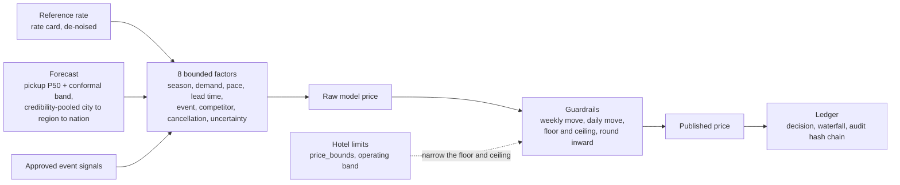

# Rate Ledger: hotel prices that explain themselves

**PixelMinds · APS-02 Dynamic Pricing**

Rate Ledger is a transparent dynamic-pricing system for hotels. It prices every room for every night from
demand, forecasts and local events, and keeps each price inside limits the hotel has approved. Every
published price has three things: a **reason** (an exact factor-by-factor breakdown), a **bound** (the
floor, ceiling and movement limits it respects), and an **audit trail** (a hash-chained record that replays
exactly).

It has two surfaces:

- **Traveller portal** (`/`): search a city, see live prices with a 90-night price trail, open a **Price
  Pass**, a held quote with a plain-language "Why this price?". Available in English, हिन्दी and ಕನ್ನಡ.
- **Revenue Desk** (`/desk`): the control room. It has the price curve with the allowed range per night,
  the guardrail **Clamp Report**, a decision record for every price, approvals, controls (bounds, overrides,
  kill switch, operating band), event signals, a what-if simulator, metrics, the audit log and live proof.

| Traveller: home | Traveller: Price Pass |
|---|---|
|  |  |
| **Revenue Desk: curve & clamps** | **Revenue Desk: decision record** |
|  |  |

All screens are in [`docs/screenshots/`](docs/screenshots), including 375 px phone views, Hindi, and every
desk section. They are regenerated with `node e2e/screenshots.mjs ../docs/screenshots` from `frontend/`.

---

## Quickstart

Requirements: Python 3.12+ (tested on 3.14) and Node 20+ (tested on 25). No Docker needed.

**Windows (PowerShell)**
```powershell
cd Solution
.\scripts\start.ps1
```

**macOS / Linux**
```sh
cd Solution
sh scripts/start.sh
```

The first run creates `.venv`, installs the backend and seeds `var/pricing.db` from the organiser's
`APS-02.db`, which is opened read-only and checksum-verified. It also writes `.env` with a fresh
`ADMIN_TOKEN` and builds the UI. Then open **http://127.0.0.1:8000**. To enter the Revenue Desk, paste
`ADMIN_TOKEN` from `.env` into the sign-in page at `/desk`. The token is held in the tab's memory only.

To run the pieces by hand:
```sh
python -m venv .venv && .venv/Scripts/python -m pip install -r backend/requirements.txt   # (bin/ on macOS/Linux)
.venv/Scripts/python -m scripts.seed                 # ≈1–4 min: 15-day warm-up replay of the pricing engine
cd frontend && npm ci && npx vite build && cd ..
.venv/Scripts/python -m uvicorn app.main:app --app-dir backend/src --host 127.0.0.1 --port 8000
```

AI features run **offline by default** (deterministic templates and rules), so no API key is needed. To use
Claude, set `LLM_PROVIDER=anthropic` and `ANTHROPIC_API_KEY` in `.env`.

---

## How a price is made



1. **Reference rate.** The hotel's nightly rate card with night-to-night noise removed: room level ×
   weekday profile × monthly trend, keeping date-specific pricing only when it persists (D-17).
2. **Forecast.** Demand is forecast by *pickup*: bookings already on the books plus expected late bookings
   from the learned lead-time curve. It gets a split-conformal P10–P90 band, and the champion is chosen
   automatically against LightGBM and naive challengers. Thin data is pooled city → region → national by
   Bühlmann credibility, so a noisy forecast barely moves a price.
3. **Eight factors.** Each is a bounded multiplier with recorded evidence, in a fixed order. The
   competitor factor is **off by default**, because the data has no competitor rates.
4. **Guardrails.** Weekly move → daily move → floor/ceiling → rounding inward. The floor and ceiling are the
   hotel's `price_bounds`, narrowed by an **operating band** of −20% / +35% around the reference rate (D-18),
   which is editable in Controls.
5. **Approval gate.** Moves larger than the auto-apply band (8%), or robust-z anomalies, wait for a person.
6. **Ledger.** Every decision stores its inputs, factors, clamp chain and an exact waterfall (the
   contributions sum to the paisa), and the audit log is hash-chained and append-only.

## Guardrail Clamp Report

The Curve & clamps page leads with a sentence such as *"3 of 90 prices clamped: 0 by ceiling, 0 by floor, 3 by
daily-movement"*. The curve draws the published line inside the per-night allowed range, and each clamped
night gets a stamp: ▲ ceiling, ▼ floor, ◆ daily move, ■ weekly move. It also shows a ghost dot at the raw
model price and a whisker down to the published price. Click any night to open its decision record:
reference → raw → published, the limits in force, the guardrail chain, the factor waterfall, the forecast
behind the demand factor, and the check that it reconstructs and replays exactly. Prices set by manual
overrides or the kill switch are shown but never counted as clamps.

## Accuracy, honestly measured

From [`docs/METRICS.md`](docs/METRICS.md), generated by `python -m scripts.metrics` through the production
code on held-out June–July 2026 data:

| Level × grain | Bookings / week | Ours | Naive | Hindsight oracle (cheats) |
|---|---|---|---|---|
| National × week | 23.2 | **88.5%** | 87.0% | 90.4% |
| National × day | 23.2 | **63.7%** | 56.1% | 55.7% |
| Region × week | 2.3 | **63.5%** | 55.9% | 62.7% |
| City × week, within ±1 booking | 0.4 | **95.7%** | 93.0% | 92.5% |

- The provided bookings are a constant-rate Poisson process (dispersion 1.04). The oracle knows the true
  level from the future, so its gap to 100% is pure randomness.
- Our model matches the oracle, or beats it where it can use bookings already on the books.
- At city level, 1 − WAPE is meaningless: a forecast of zero bookings scores the same ≈0%. Measures built
  for small counts are reported instead.
- City × day error is 27.3% lower than naive, and the P10–P90 band covers 81.0% against an 80% target.

## Data: what trains the model

**Every forecast and every price comes from the organiser's `APS-02.db`. We generate no mock bookings or
prices.** The forecast is trained on all 14,234 hotel events (13 months: 1,332 bookings, 728
cancellations, 8,749 searches, 2,554 views, 871 abandons). The reference rate uses all 10,530 room-nights
of the rate calendar, and all 1,200 room price limits are enforced. Flight data is not used, because
flights are cut. The few things the dataset has no data for (competitor rates, room names, an events
calendar) are listed with their effect on prices in [`docs/DATA_USAGE.md`](docs/DATA_USAGE.md).

## Data-model usage

- **Canonical tables** (the 13 provided tables) keep their schema byte-for-byte. We read `pricing_events`,
  `inventory_calendar`, `price_bounds`, `price_history`, `cities` and `currencies`. We write back only
  what a live system would: `inventory_calendar.price`/`held_units`/`booked_units`, `price_history` rows,
  and booking events.
- **Our tables** are 16 `dp_` tables (`data-model/dp_schema.sqlite.sql`): cycles, versioned bounds and
  engine config, baselines, features, forecasts, model selection, decisions, quotes, overrides, event
  signals, narrations, experiments, catalog links and an append-only hash-chained audit log.
- **Rules R1–R8** (ids, ISO timestamps, money as decimal strings, enums, snake_case) are checked by the
  organiser's validator (Tier 1, PASS), by our Tier-2 checker on the canonical tables we write, and by tests.
- **Organiser files** are never modified: `DynamicPricing/` is read-only and verified against
  `SHA256SUMS.txt` (29 files) at seed time, in tests and on the Proof page.

## AI features, each with a gate

| | What it does | Gate |
|---|---|---|
| A1 Forecaster | pickup P50 + conformal band, automatic champion/challenger | rolling-origin backtest; must beat naive |
| A2 Narrator | "Why this price?" in en-IN / hi / kn | numeric gate: every number in the text must exist in the decision (Devanagari and Kannada digits normalised); otherwise it falls back to a template |
| A3 Event extractor | turns a curated event feed into signals | signals are **inert** until a person approves them; precision measured on 30 labelled rows |
| A4 What-if parser | plain language → strict `WhatIfConfig` | unknown or out-of-range requests are rejected, never coerced; 20/20 parsed, 8/8 malformed rejected |
| A5 Anomaly summary | one-line explanation of flagged moves | flags come from a robust-z test, not the LLM |

No LLM ever produces a price. The engine computes every number.

## Testing, conformance and security

| Check | Result |
|---|---|
| `pytest tests` | 80 passed (unit, Hypothesis property tests, integration, conformance) |
| `vitest` | 5 passed |
| Organiser validator (`validate_conformance.py`) | PASS on the live DB |
| Proof (live) | I1 bounded, I3 explainable, I4 replayable, I5 inert signals, I6 clamp consistency, Tier 1 + Tier 2, audit chain, organiser checksums: all green |
| `bandit -r backend/src` | 0 high, 0 medium, 2 low (fixed-argument subprocess running the organiser validator) |
| `pip-audit` (runtime and dev requirements) | no known vulnerabilities |
| `npm audit --audit-level=high` | 0 vulnerabilities |

Security: constant-time bearer auth that fails closed, per-IP token-bucket rate limits, a 64 KB body cap, a
strict CSP and security headers, parameterised SQL only (IN-lists via `json_each`), no float arithmetic on
money, `.env` git-ignored, and the admin token never stored in browser storage. See
[`docs/SECURITY.md`](docs/SECURITY.md).

## Documents

| Document | Contents |
|---|---|
| [`docs/ARCHITECTURE.md`](docs/ARCHITECTURE.md) | full system design (source of truth) |
| [`docs/ARCHITECTURE_NOTE.md`](docs/ARCHITECTURE_NOTE.md) | 2-page summary |
| [`docs/DECISIONS.md`](docs/DECISIONS.md) | every decision taken during the build, with its reason |
| [`docs/METRICS.md`](docs/METRICS.md) | generated accuracy, band and AI-eval results |
| [`docs/DATA_USAGE.md`](docs/DATA_USAGE.md) | exactly which organiser data is used, and what isn't organiser data |
| [`docs/SECURITY.md`](docs/SECURITY.md) | STRIDE threat model, controls → tests, scan outputs |
| [`docs/TRACEABILITY.md`](docs/TRACEABILITY.md) | requirement → code → test → demo click |
| [`docs/DEMO_SCRIPT.md`](docs/DEMO_SCRIPT.md) | the 3-minute demo, click by click |
| [`docs/SOLUTION_WRITEUP.md`](docs/SOLUTION_WRITEUP.md) | the write-up, structured for the organisers' template |
| [`docs/PRESENTATION_OUTLINE.md`](docs/PRESENTATION_OUTLINE.md) | slide-by-slide outline |

## Limitations

- **Synthetic data.** Bookings are sparse (about 0.08 per city per night). The demand forecast therefore
  carries little signal at city level, and prices are driven mostly by the reference rate, lead time,
  booking pace and approved events. With real volume, credibility rises and the
  forecast drives more of the price with no code change.
- **No competitor rates in the data.** The competitor factor is therefore off by default, so no simulated
  number moves a live price. It can be enabled in Controls once a real rate feed exists.
- **No revenue optimiser.** The data shows almost no measurable price response (the elasticity is about 0),
  so the what-if simulator compares rule sets with a stated elasticity prior and a range, instead of
  claiming an optimum.
- **Operating band** (−20% / +35%) is a stated business policy, not a fitted value.
- **Single process, SQLite.** Fine for a hotel group's desk and this demo. Postgres is the documented path
  for scale.

## Team

PixelMinds: Siddhant Patil · Vineet R Kamath · Manoj Kumar N · Srijan Vachadmath · Manohara Salmani
