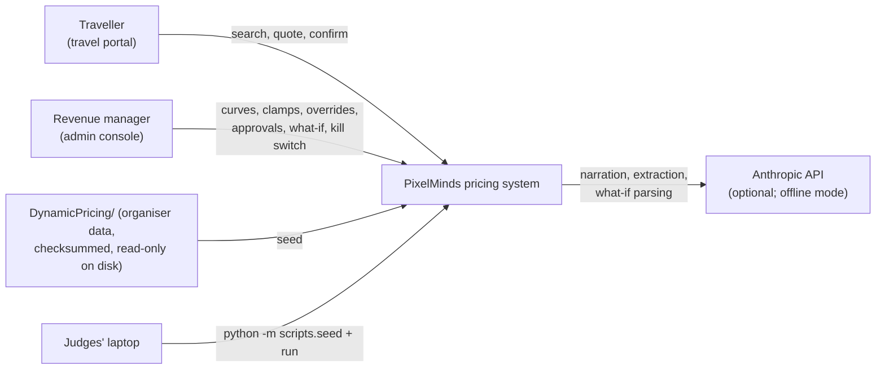
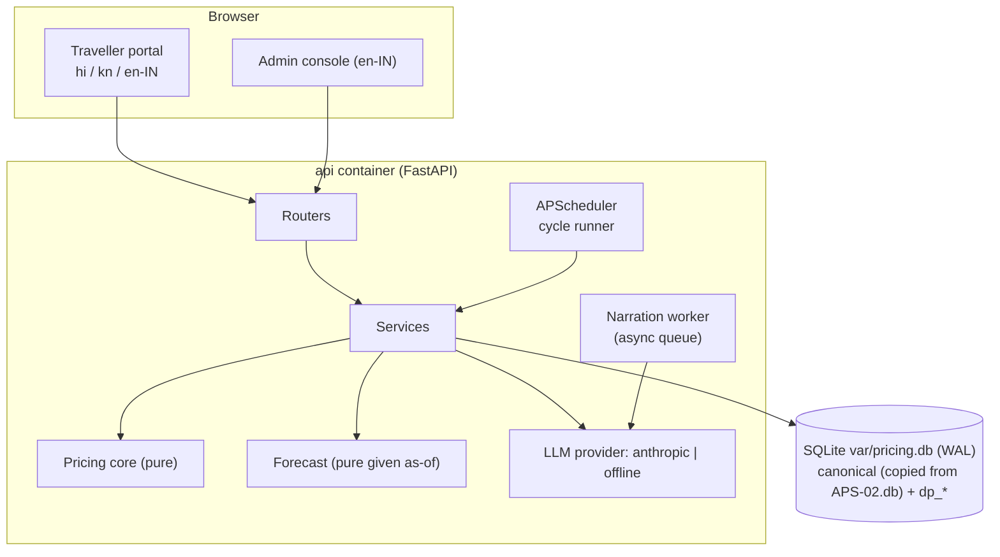
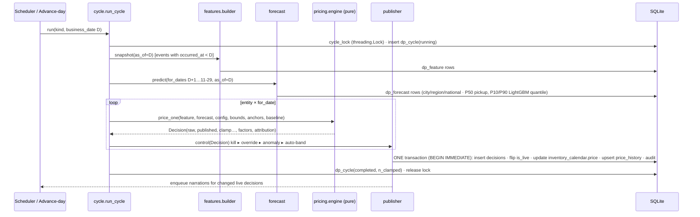
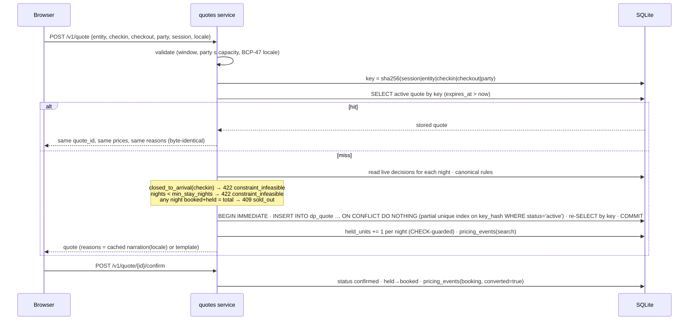

# PixelMinds — Architecture & System Design (v3, final)

**APS-02 · Real-Time Dynamic Pricing & Demand Forecasting · KogniVera Hackathon 2026**
Sprint: Thu 24 Sep 12:00 → Fri 25 Sep 12:00 · feature stop 09:00 · submit by 12:00

This supersedes the architecture in `PROJECT_PLAN.md` v2 and `PixelMinds_Design_v1.pdf` wherever they differ. Every difference is listed in §2 with the evidence behind it, so we can explain it on stage ("be ready to say why", design guide §6).

**Runtime decision (24 Sep, 11:45): SQLite, no Docker.** The build runs on a working copy of the organisers' `APS-02.db`, plus our `dp_` tables, with FastAPI and Vite run directly. Postgres and Docker remain an optional deployment path (§14.3). The reasons are in F16.

### Tech stack (final)

| Layer | Choice | Why |
|---|---|---|
| Runtime | Python 3.11+ (dev machine: 3.14), FastAPI, Pydantic v2, uvicorn | one language from features to model to API; Pydantic validates R2–R6 at the boundary and the LLM output |
| Database | **SQLite 3.50** (stdlib `sqlite3`, WAL mode, `PRAGMA foreign_keys=ON`) on a copy of `APS-02.db` | the provided data already lives in it; the organisers' validator reads it natively; nothing to install |
| DB access | SQLAlchemy 2 Core (SQLite dialect; the same code runs on Postgres) | readable SQL, portable |
| Scheduler | APScheduler (in-process) + a manual **Advance day** | micro-batch is allowed by the statement |
| Forecast | pandas, NumPy, SciPy, **LightGBM 4.7** (installs cleanly on Python 3.14) | **P50 = additive pickup** (best MAE and WAPE); **P10/P90 = LightGBM quantile regression** (the best intervals: interval score 1.79 vs 2.00). Each component is used where it wins on the backtest (§7.3). statsmodels and sklearn HistGradientBoosting are dropped (LightGBM beats HGB on every metric) |
| Money | `decimal.Decimal` (Python), strings in JSON, `decimal.js` (UI) | R3 |
| LLM | `anthropic` SDK: Claude Haiku 4.5 (narration), Claude Sonnet 5 (what-if, extraction); `offline` provider by default | the live AI feature, with a safe fallback |
| Frontend | React 18 + Vite + TypeScript, Tailwind + shadcn/ui, Recharts, TanStack Query, i18next, `Intl` | |
| Tests | pytest, Hypothesis, Vitest (+ Playwright, tier 2) | |
| Cache | ~~Redis~~ **dropped**: quote stability is a DB guarantee (§9.1) | one moving part fewer |

---

## 0. Contents

1. Sources and how each one is used
2. What the organiser material and data change (v2 → v3)
3. System context and containers
4. Components and module layout
5. Data design (canonical usage + `dp_` DDL)
6. Pricing core: cycle, factors, guardrails, attribution
7. Forecasting for highest accuracy, and generalization to real data (§7.7)
8. Guardrail Clamp Report (mandatory)
9. Quote, control and simulation flows (sequence diagrams)
10. AI features: grounding and gates
11. API contracts
12. Correctness, conformance and test design
13. Non-functional design: determinism, latency, failure modes
14. Deployment and runbook
15. Schedule deltas, cut order, demo

---

## 1. Sources and how each one is used

| Organiser file (`DynamicPricing/`) | What it fixes for us | Where it is honoured |
|---|---|---|
| `README.md` | 7 steps; the 4 deliverables at 12:00; "a genuine, working AI feature — not a mock"; at least one Indian language | §10 live AI, §15 deliverables, §8 of the plan |
| `01_YOUR_DATA_MODEL.md` | 13 tables, every column, R1–R8, the "~1% outliers" warning, the polymorphic `(entity_type, entity_id)` reference | §5, §12 |
| `02_DATA_MODEL_DIAGRAM.html` | Tiering (Tier 1: `inventory_calendar`, `cities`, `currencies`, `languages`, `hotels`, `flights`, `countries`; Tier 2: `pricing_events`, `price_bounds`, `price_history`, `flight_fares`, `airports`, `airlines`). **Integration spine = `inventory_calendar` + `currencies`**. The polymorphic edges `room_type / flight_fare` | §5.1 write rules, §12.2 |
| `03_DESIGN_SUBMISSION_GUIDE.md` | Build may differ from design, but the team must say why | §2 |
| `04_HACKATHON_DAY_PROCESS.md` | First hour: no code, agree the demo flow, owners and cut list; 09:00 feature stop; 2 rehearsals; running app within the first 2 minutes; recorded offline fallback; "coherent travel portal" theme | §15 |
| `data/WORKING_WITH_THE_DATA.md` | Money never touches a float (`dtype=str` → `Decimal`); largest-remainder splits; JPY/KWD exponents are for display only; the Postgres load loop (optional path) | §5.3, §6.4, §13 |
| `data/schema.sqlite.sql` | **Our runtime schema for canonical tables.** Money is `TEXT` (NUMERIC affinity would turn `8500.00` into a float), timestamps are ISO `TEXT` with an offset, booleans are `INTEGER` 0/1, `PRAGMA foreign_keys=ON` | §5; our `dp_` tables follow the same conventions |
| `data/schema.sql` | Canonical Postgres DDL (`CREATE EXTENSION vector` → `pgvector/pgvector:pg16`) | the optional Postgres path (§14.3), loaded unedited |
| `data/enums.json` | Legal values, including the ones we reuse: `hold_status`, `error_code` (incl. `low_confidence`, `sold_out`, `hold_expired`, `idempotency_conflict`, `currency_mismatch`, `invalid_id`), `confidence_band`, `pricing_event_type`, `channel`, `inventory_entity_type`, `season`, `record_status` | §5.2, §11 |
| `data/queries/starter_queries.sql` | The 6 views the organisers expect: seasonality, lead-time conversion, guardrails, a worked factor curve, clamp rate, cancellations | Metrics page reproduces queries 1, 2, 5 and 6 on our data |
| `tools/validate_conformance.py` | Checks **Tier 1 only** (23 platform tables; 7 present here). It reads a SQLite file or a CSV directory. `_at` must match `…(Z|±HH:MM)` | §12.2 (and our own Tier-2 checker for the tables it skips) |
| `SHA256SUMS.txt` | The provided files must stay byte-identical | CI step `sha256sum -c` |

The **platform contract inside the validator** also defines `hotel_room_types` (prefix `rmt`, with `hotel_id`, `base_rate`, `total_units` …) and `holds` (prefix `hld`, with `inventory_id`, `user_id`, `idempotency_key`, `expires_at`, `status: hold_status`). We were not given either table. We do **not** create them, because inventing canonical rows would clash when the 16 builds are merged. Our `dp_catalog_link` and `dp_quote` are shaped so that a view can map them onto those tables later (§5.2).

---

## 2. What the organiser material and data change (v2 → v3)

All numbers come from `DynamicPricing/data/APS-02.db`. The queries are in the Appendix, and the forecasting backtest is `docs/research/forecast_backtest.py`.

| # | Evidence | v3 decision |
|---|---|---|
| F1 | Events end **2026-08-30**. The forward calendar runs 2026-09-01 → 11-29. The wall clock today is 2026-09-24. | A **business clock** (`dp_clock.business_date`, starting at 2026-08-31) drives every pricing and forecasting calculation. The wall clock is used only for `_at` stamps and quote TTL. |
| F2 | `max_daily_move_pct` is 5–15%. A first publication is anchored to the baseline. | **Warm-up replay** of 14 business days before the demo, then **Advance day** on stage. Daily clamps are then genuine, not artefacts of cycle 1. |
| F3 | Baselines sit at 15–63% of the band (ceiling/floor = 2.467 for every entity). The provided `demand_index` p5–p95 is 0.52–1.12. | Demand-pressure bound **0.70–1.30** (v2: 0.90–1.25), so floor and ceiling clamps can occur organically. |
| F4 | 117 room types have a 90-day calendar. **31** resolve to a city (only via `pricing_events.city_id`) and **11** have events, history and bounds. **0** are in a Kannada-speaking city. | Demo entities: **Udaipur** (`rmt_693809d0` and `rmt_039a87b5`), INR, `hi`, peak months 10,11,12,2. The traveller UI defaults to `hi` and switches live to `kn`. The 86 city-less room types are priced on the national forecast and are hidden from traveller search. |
| F5 | `flight_fare` has **1** calendar row per fare. | Flight pricing is **cut**. |
| F6 | Every session has exactly **1** event; `converted` = is a booking. | No per-search conversion model. The simulator uses an **aggregate elasticity** with a stated prior (§7.6). |
| F7 | Mean occupancy is **4.9%**; 138 sold-out and 424 `closed_to_arrival` rows. | Demand pressure is **relative to normal**, not measured against remaining units. `sold_out`, `closed_to_arrival` and `min_stay_nights` are enforced in the quote service. |
| F8 | Cancellations are **56%** of bookings. | We forecast **net** demand = gross bookings × (1 − cancellation rate by lead bucket). |
| F9 | **Per-city `peak_months` show no uplift** (31.2% of events fall in peak months vs 33.1% expected under uniform). Day-of-week shows no uplift (244–282 bookings per weekday). | Seasonality is **learned, not hard-coded, and not removed**: month, day-of-week and holiday indices are estimated from the deployment's own history with shrinkage toward 1.0 (§7.7). On this dataset they shrink to ≈ 1.0, as the evidence says; on real data with seasonality they grow automatically. We never delete a signal just because this sample lacks it. |
| F10 | A year-ago seasonal-naive baseline is impossible for 12 of the 13 months. | The baseline is the **trailing-rate naive** forecast (city booking rate over the last 56 stay dates). |
| F11 | The validator ignores Tier-2 tables (`pricing_events`, `price_bounds`, `price_history`). | v2's claim that "our appended `pricing_events` rows pass the validator" is vacuous. We add **`tests/conformance/tier2_check.py`**, which reuses the validator's own regexes and `enums.json` for the Tier-2 tables we write. |
| F12 | The validator needs `_at` values ending in `Z` or `±HH:MM`. The provided data writes `2026-08-18T10:00:00+05:30`. | `core/clock.wall_now_iso()` is the **only** producer of `_at` strings: `datetime.now(ZoneInfo('Asia/Kolkata')).isoformat(timespec='seconds')`. (On the Postgres path, the export runs `SET TIME ZONE 'Asia/Kolkata'`, because Postgres prints UTC as `+00`, which fails.) |
| F13 | v2 attribution divides by Σ ln mᵢ, which is 0 when published = baseline. | **Telescoping** attribution, with no division (§6.4). |
| F14 | The quote key includes the config version. | A quote is **honoured until expiry**. A partial unique index in the DB is the guarantee; Redis is dropped (§9.1). |
| F15 | Outliers were not found in `quoted_price` or the calendar price. `price_history.price` has 0.64% of rows beyond 5 MAD. | A robust (MAD) filter on every price-derived feature, tested with injected outliers. Ask the data channel where the 1% sits. |
| F16 | The build machine has no Docker or Postgres. SQLite 3.50 is in the stdlib. The provided data ships as SQLite, the validator reads SQLite directly, and the whole workload is one writer at about 10k rows per cycle. | **SQLite runtime.** This removes the load step, the CSV export and the timestamp trap. It keeps the canonical tables byte-identical, because we copy the provided file. The costs are one writer at a time (fine: one API process, WAL mode) and money kept as TEXT, so it is **never** aggregated in SQL (`SUM(price)` would cast to a float); every money sum happens in Python `Decimal`. |
| F17 | In the provided SQLite, the `pct` columns (NUMERIC affinity) are stored as integers or reals, e.g. `max_daily_move_pct = 8`. | Read them as `Decimal(str(value))`, never as a float in arithmetic. `money.pct()` handles int, float and str inputs. |

---

## 3. System context and containers

### 3.1 Context



### 3.2 Processes (no Docker)

| Process | Command | Role |
|---|---|---|
| `api` | `uvicorn app.main:app --port 8000` (a **single** worker) | HTTP API + in-process APScheduler cycle runner + narration worker thread |
| `web` | `npm run dev` (demo: `npm run build && npm run preview`) on :5173, proxying `/v1` → :8000 | traveller portal + admin console |
| database file | `var/pricing.db` (a working copy of `APS-02.db` + `dp_` tables; WAL mode) | the single source of truth |

One API process keeps determinism simple: one scheduler and one cycle at a time. A `threading.Lock` plus `BEGIN IMMEDIATE` (SQLite's single-writer lock) guard each cycle, and readers keep working during a cycle thanks to WAL.



---

## 4. Components and module layout

```
backend/src/app/
├── contracts/        Pydantic v2 models = the single schema for API, config, LLM output (FROZEN 14:00)
├── core/
│   ├── clock.py          business_date(), wall_now()   — the ONLY place time is read
│   ├── money.py          Money(amount: Decimal, currency), quantize(), largest_remainder()
│   └── ids.py            new_id(prefix) → "dpd_9f2c1a…" (opaque, R2)
├── pricing/          PURE — no I/O, no clock reads, Decimal only
│   ├── factors.py        8 factor functions: FeatureRow × Forecast × Config → Factor(value, raw, evidence)
│   ├── guardrails.py     apply_chain(raw, bounds, anchors) → GuardrailResult
│   ├── attribution.py    telescoping waterfall + largest remainder
│   ├── engine.py         price_one(inputs) → Decision   (factors → raw → guardrails → attribution)
│   └── anomaly.py        MAD z-score on moves
├── forecast/         PURE given an as-of snapshot
│   ├── interface.py      Forecaster.predict(city, for_dates, as_of) → Quantiles(p10,p50,p90, band)
│   ├── pickup.py         champion: additive pickup + EB shrinkage + cancellation netting
│   ├── lgbm_quantile.py  LightGBM quantile (α=0.1, 0.9) on the 7-day signal → P10/P90
│   ├── lgbm_point.py     challenger for P50: LightGBM Poisson (reported; ships only if it wins the gate)
│   ├── conformal.py      coverage check + CQR correction; fallback intervals if LightGBM is unavailable
│   ├── elasticity.py     aggregate price response (simulator only)
│   ├── hierarchy.py      EB pooling entity → city → region → national; estimated k, κ (G3, G4)
│   ├── seasonal.py       shrunk month / DOW / holiday indices (G3)
│   ├── selection.py      nightly champion/challenger on the deployment's own history (G1)
│   ├── monitor.py        drift + coverage + data-quality monitors (G6)
│   ├── defaults.py       the ONLY place priors live; data-free
│   └── backtest.py       rolling-origin harness (same code as docs/research)
├── features/builder.py   as-of snapshot → dp_feature (SQL window functions + pandas, MAD filter)
├── services/
│   ├── cycle.py          run_cycle(kind, business_date, config) — the ONLY writer of decisions
│   ├── publisher.py      control (kill ▸ override ▸ approval) + canonical write-back
│   ├── quotes.py         stability, canonical business rules, confirm
│   ├── approvals.py · overrides.py · bounds.py · killswitch.py
│   ├── simulator.py      same engine, alternate config/clock, never publishes
│   ├── ingest.py         POST /v1/events → pricing_events (validated)
│   └── audit.py          append-only, hash-chained (tier 2)
├── ai/               llm/provider.py · narrator/ (A2 + gate) · event_extractor/ (A3) · whatif/ (A4) · prompts/*.v1.md
├── db/               SQLAlchemy Core tables + queries (canonical tables mapped verbatim)
└── api/              routers: quote, events, admin, reports, simulation, evidence
```

### 4.1 Frontend

```
frontend/src/
├── api/            client.ts (fetch + TS types generated from docs/openapi.json by openapi-typescript)
├── lib/            money.ts (decimal.js + Intl, minor_unit_exponent) · dates.ts (zoneless _date handling) · locale.ts
├── i18n/           en-IN.json · hi.json · kn.json  (static strings only; numbers never live in bundles)
├── pages/Traveller/
│   ├── Search.tsx          city (demo: Udaipur) → dates → party size; locale switcher hi | kn | en-IN
│   ├── Results.tsx         room cards (hotel name via dp_catalog_link), nightly + total price
│   ├── WhyThisPrice.tsx    reasons[] + floor/ceiling line + "held for mm:ss"
│   └── HoldTimer.tsx       counts down to expires_at; on expiry re-quotes (new quote_id shown)
└── pages/Admin/
    ├── PriceCurve.tsx      Recharts ComposedChart: band (Area floor→ceiling), published (Line),
    │                       raw ghost dots (Scatter) + whiskers, clamp markers (custom shapes ▲▼◆■)
    ├── ClampHeader.tsx     "14 of 90 prices clamped — …" from /v1/clamps/summary (never computed in the browser)
    ├── DecisionDrawer.tsx  raw → published · bound · anchors · clamp chain · Waterfall · top drivers
    ├── Waterfall.tsx       stacked-bar waterfall from explain.waterfall[] (amounts are strings → decimal.js)
    ├── ForecastFan.tsx     P10–P90 area + P50 line + actuals; "today" = business_date
    ├── Controls.tsx        bounds editor (reason required) · engine config · kill switch · Advance day
    ├── ApprovalQueue.tsx   pending decisions with reason + anomaly summary; approve/reject with note
    ├── Overrides.tsx       create (price, date range, reason, expiry) / revoke
    ├── EventSignals.tsx    extracted signals; approve (A3)
    ├── Simulator.tsx       prompt → parsed config diff (confirm) → A vs B curves + metrics + revenue range
    ├── Metrics.tsx         backtest table, coverage, starter-query views, faithfulness pass rate
    ├── AuditLog.tsx        paged log + verify badge
    └── ProofPanel.tsx      /v1/proof: invariants, validator, tier-2 check — green/red
```
State: TanStack Query, with the query key including `cycle_id`. After any control action the UI polls `/v1/cycles/latest` until the cycle id changes, then invalidates. No price arithmetic happens in the browser, only formatting.

**Dependency rule, checked by an import-linter test:** `pricing/` and `forecast/` import nothing from `db/`, `api/`, `services/` or `ai/`, and never call `datetime.now()` or `date.today()`. That is what makes the simulator exact (it replays the very same functions) and every decision reproducible.

---

## 5. Data design

### 5.1 Canonical tables: access rules

| Table | Tier | Read | Write (only these) |
|---|---|---|---|
| `inventory_calendar` | 1 · **spine** | units, price, currency, `min_stay_nights`, `closed_to_arrival` | `price` and `updated_at` on publish; `held_units` ±1 on quote hold/release; `booked_units` +1 on confirm (DB CHECK guards oversell) |
| `price_bounds` | 2 | all guardrail fields | bounds editor: values + `updated_at` (each change versioned in `dp_bounds_version`); `override_active` flipped by the override service |
| `price_history` | 2 | factor shape reference; historical curve | upsert one row per entity × **stay date** (effective_date), with the 5 canonical factors, `occupancy_pct`, `bound_clamped`, `explanation`, `computed_at` |
| `pricing_events` | 2 | the demand signal | append-only via `POST /v1/events` and quote confirm (`pev_` ids) |
| `cities`, `currencies`, `languages`, `hotels`, `countries` | 1 | reference | none |
| `flights`, `flight_fares`, `airports`, `airlines` | 1/2 | loaded (conformance); unused (F5) | none |

`price_history` never collides with provided rows: the provided rows are effective Jul 14 – Aug 17, and ours are Sep 1 – Nov 29.

### 5.2 Tables we add (`data-model/dp_schema.sqlite.sql`)

Conventions follow `schema.sqlite.sql` exactly, so the `dp_` tables look like the canonical ones:

| Kind of value | SQLite storage | Rule |
|---|---|---|
| id | `TEXT`, opaque prefix (`dpd_…`) | R2; `core/ids.new_id(prefix)` = prefix + 12 hex from `secrets` |
| money | `TEXT` (`'5200.00'`), always paired with `currency TEXT REFERENCES currencies(iso4217)` | R3; a CHECK enforces the 2-place format; **never aggregated in SQL** |
| factor / pct / quantile | `TEXT` decimal string (`'1.184'`) | exact round-trip through `Decimal` |
| `_at` | `TEXT` ISO-8601 with offset (`2026-09-24T13:05:00+05:30`) | R4; produced only by `clock.wall_now_iso()` |
| `_date` | `TEXT` `YYYY-MM-DD` | R4; CHECK `length = 10` |
| bool | `INTEGER` 0/1 with CHECK | like `closed_to_arrival` |
| JSON | `TEXT` with CHECK `json_valid(x)`, and decimals inside as strings | |
| enum | `TEXT` with CHECK `IN (…)`, lowercase snake_case | R5 |
| mutable rows | `status` + `updated_at`; no DELETE (enforced by trigger on audit, by code review elsewhere) | R8 |

```sql
PRAGMA foreign_keys = ON;
PRAGMA journal_mode = WAL;

-- the clock and the cycle ------------------------------------------------------
CREATE TABLE dp_clock (
  clock_id        TEXT PRIMARY KEY,                    -- 'dpck_main'
  business_date   TEXT NOT NULL CHECK (length(business_date) = 10),
  status          TEXT NOT NULL DEFAULT 'active',
  updated_at      TEXT NOT NULL);

CREATE TABLE dp_cycle (
  cycle_id        TEXT PRIMARY KEY,                    -- dpy_
  kind            TEXT NOT NULL CHECK (kind IN ('warmup','advance','reprice','simulation')),
  business_date   TEXT NOT NULL,
  engine_config_version INTEGER NOT NULL,
  model_version   TEXT NOT NULL,
  n_decisions     INTEGER, n_clamped INTEGER,
  status          TEXT NOT NULL CHECK (status IN ('running','completed','failed','degraded')),
  started_at      TEXT NOT NULL, finished_at TEXT, updated_at TEXT NOT NULL);

-- configuration (append-only versions) -------------------------------------------
CREATE TABLE dp_engine_config (
  config_id       TEXT PRIMARY KEY,                    -- dpc_
  version         INTEGER NOT NULL UNIQUE,
  factor_bounds   TEXT NOT NULL CHECK (json_valid(factor_bounds)),  -- {"demand":{"lo":"0.70","hi":"1.30","enabled":true},…}
  auto_band_pct   TEXT NOT NULL,
  anomaly_z       TEXT NOT NULL DEFAULT '2.50',
  anomaly_move_pct TEXT NOT NULL DEFAULT '12.00',
  kill_switch_active INTEGER NOT NULL DEFAULT 0 CHECK (kill_switch_active IN (0,1)),
  actor           TEXT NOT NULL, reason TEXT NOT NULL,
  status          TEXT NOT NULL CHECK (status IN ('active','inactive','archived','draft')),
  effective_from_at TEXT NOT NULL, updated_at TEXT NOT NULL);

CREATE TABLE dp_bounds_version (
  bounds_version_id TEXT PRIMARY KEY,                  -- dpv_
  bound_id        TEXT NOT NULL REFERENCES price_bounds(bound_id),
  version         INTEGER NOT NULL,
  floor_price     TEXT NOT NULL, ceiling_price TEXT NOT NULL,
  currency        TEXT NOT NULL REFERENCES currencies(iso4217),
  max_daily_move_pct TEXT NOT NULL, max_weekly_move_pct TEXT NOT NULL,
  rounding_step   TEXT NOT NULL, override_active INTEGER NOT NULL CHECK (override_active IN (0,1)),
  actor           TEXT NOT NULL, reason TEXT NOT NULL, created_at TEXT NOT NULL,
  UNIQUE (bound_id, version));
-- version 1 of every bound = a snapshot of the provided price_bounds row at seed time

CREATE TABLE dp_baseline (
  baseline_id     TEXT PRIMARY KEY,                    -- dpbl_
  entity_type     TEXT NOT NULL CHECK (entity_type IN ('room_type','flight_fare','guide','poi')),
  entity_id       TEXT NOT NULL, for_date TEXT NOT NULL,
  baseline_price  TEXT NOT NULL CHECK (baseline_price GLOB '*[0-9].[0-9][0-9]'),
  currency        TEXT NOT NULL REFERENCES currencies(iso4217),
  source          TEXT NOT NULL DEFAULT 'inventory_calendar_snapshot', created_at TEXT NOT NULL,
  UNIQUE (entity_type, entity_id, for_date));

-- intelligence ---------------------------------------------------------------------
CREATE TABLE dp_feature (
  feature_id      TEXT PRIMARY KEY,                    -- dpx_
  entity_type     TEXT NOT NULL, entity_id TEXT NOT NULL,
  city_id         TEXT REFERENCES cities(city_id),     -- NULL for the 86 city-less room types
  for_date        TEXT NOT NULL, as_of_date TEXT NOT NULL,
  lead_time_days  INTEGER NOT NULL, occupancy_pct TEXT NOT NULL,
  otb_bookings INTEGER NOT NULL, otb_cancellations INTEGER NOT NULL,
  otb_searches INTEGER NOT NULL, otb_views INTEGER NOT NULL,
  pace_ratio TEXT, cxl_rate_28d TEXT, comp_index TEXT, event_score TEXT,
  created_at      TEXT NOT NULL,
  UNIQUE (entity_type, entity_id, for_date, as_of_date));

CREATE TABLE dp_forecast (
  forecast_id     TEXT PRIMARY KEY,                    -- dpf_
  level           TEXT NOT NULL CHECK (level IN ('city','region','national')),
  level_key       TEXT NOT NULL,                       -- city_id | region name | 'all'
  for_date TEXT NOT NULL, as_of_date TEXT NOT NULL,
  p10 TEXT NOT NULL, p50 TEXT NOT NULL, p90 TEXT NOT NULL,
  normal_level    TEXT NOT NULL,                       -- demand-index denominator
  credibility     TEXT NOT NULL,                       -- z in [0,1] (section 7.4)
  confidence_band TEXT NOT NULL CHECK (confidence_band IN ('high','medium','low')),   -- enums.json
  method          TEXT NOT NULL CHECK (method IN ('pickup_lgbmq','pickup_conformal','lgbm','trailing_naive')),
  model_version   TEXT NOT NULL, created_at TEXT NOT NULL,
  UNIQUE (level, level_key, for_date, as_of_date, model_version));

CREATE TABLE dp_model_selection (           -- G1: which model won, on which data, by how much
  selection_id    TEXT PRIMARY KEY,                    -- dpms_
  as_of_date      TEXT NOT NULL, window_from_date TEXT NOT NULL, window_to_date TEXT NOT NULL,
  component       TEXT NOT NULL CHECK (component IN ('p50','interval')),
  champion        TEXT NOT NULL, challenger TEXT,
  scores          TEXT NOT NULL CHECK (json_valid(scores)),   -- {"naive":{"dev":"0.487","mae":"0.144"},"pickup":{…},…}
  dm_p_value      TEXT, decision TEXT NOT NULL CHECK (decision IN ('keep','switch','fallback_naive')),
  params          TEXT NOT NULL CHECK (json_valid(params)),   -- estimated k, κ, windows, ACI alpha
  created_at      TEXT NOT NULL);

-- THE decision record: one row per entity x stay date x cycle -------------------------
CREATE TABLE dp_price_decision (
  decision_id     TEXT PRIMARY KEY,                    -- dpd_
  cycle_id        TEXT NOT NULL REFERENCES dp_cycle(cycle_id),
  business_date   TEXT NOT NULL,
  entity_type     TEXT NOT NULL, entity_id TEXT NOT NULL, for_date TEXT NOT NULL,
  currency        TEXT NOT NULL REFERENCES currencies(iso4217),
  baseline_price TEXT NOT NULL, raw_price TEXT NOT NULL,
  published_price TEXT NOT NULL, live_price_before TEXT NOT NULL,
  clamp_status    TEXT NOT NULL CHECK (clamp_status IN ('accepted','clamped','not_applicable')),
  clamp_bound     TEXT CHECK (clamp_bound IN ('floor','ceiling','max_daily_movement','max_weekly_movement')),
  bound_value     TEXT,
  clamp_chain     TEXT NOT NULL CHECK (json_valid(clamp_chain)),   -- [{"guardrail":"max_daily_movement","before":"6840.00","after":"6511.50"}]
  daily_anchor_price TEXT NOT NULL, weekly_anchor_price TEXT NOT NULL,
  factors         TEXT NOT NULL CHECK (json_valid(factors)),       -- [{"name":"demand","value":"1.184","lo":"0.70","hi":"1.30","evidence":{…},"contribution":"512.40"}]
  forecast_id     TEXT REFERENCES dp_forecast(forecast_id),
  feature_id      TEXT REFERENCES dp_feature(feature_id),
  bounds_version  INTEGER NOT NULL, engine_config_version INTEGER NOT NULL, model_version TEXT NOT NULL,
  source          TEXT NOT NULL CHECK (source IN ('engine','override','kill_switch')),
  approval_status TEXT NOT NULL CHECK (approval_status IN ('auto_applied','pending_approval','approved','rejected','superseded')),
  approval_reason TEXT CHECK (approval_reason IN ('outside_auto_band','anomaly_flagged')),
  decided_by TEXT, decision_note TEXT,
  anomaly_flag    INTEGER NOT NULL DEFAULT 0 CHECK (anomaly_flag IN (0,1)),
  is_live         INTEGER NOT NULL CHECK (is_live IN (0,1)),
  status          TEXT NOT NULL DEFAULT 'active', created_at TEXT NOT NULL, updated_at TEXT NOT NULL,
  UNIQUE (cycle_id, entity_type, entity_id, for_date),
  CHECK (clamp_status <> 'clamped' OR (clamp_bound IS NOT NULL AND bound_value IS NOT NULL)),
  CHECK (source = 'engine' OR clamp_status = 'not_applicable'));        -- overrides/kill never counted
CREATE INDEX dp_decision_lookup ON dp_price_decision (entity_type, entity_id, for_date, business_date);
CREATE UNIQUE INDEX dp_decision_live_one ON dp_price_decision (entity_type, entity_id, for_date) WHERE is_live = 1;

-- quotes (maps onto the platform's `holds`: key_hash = idempotency_key, status = hold_status) --------
CREATE TABLE dp_quote (
  quote_id        TEXT PRIMARY KEY,                    -- dpq_
  key_hash        TEXT NOT NULL, session_id TEXT NOT NULL,
  entity_type     TEXT NOT NULL, entity_id TEXT NOT NULL,
  checkin_date TEXT NOT NULL, checkout_date TEXT NOT NULL, party_size INTEGER NOT NULL,
  nightly         TEXT NOT NULL CHECK (json_valid(nightly)),     -- [{"for_date":"2026-10-12","price":"5200.00","decision_id":"dpd_…"}]
  total_price     TEXT NOT NULL, currency TEXT NOT NULL REFERENCES currencies(iso4217),
  locale          TEXT NOT NULL REFERENCES languages(bcp47),
  response_json   TEXT NOT NULL CHECK (json_valid(response_json)),   -- the exact body returned: byte-identical replays
  engine_config_version INTEGER NOT NULL, bounds_versions TEXT NOT NULL, business_date TEXT NOT NULL,
  status          TEXT NOT NULL CHECK (status IN ('active','confirmed','released','expired')),   -- hold_status
  expires_at TEXT NOT NULL, created_at TEXT NOT NULL, updated_at TEXT NOT NULL);
CREATE UNIQUE INDEX dp_quote_active_key ON dp_quote (key_hash) WHERE status = 'active';

-- control plane --------------------------------------------------------------------
CREATE TABLE dp_override (
  override_id     TEXT PRIMARY KEY,                    -- dpo_
  entity_type TEXT NOT NULL, entity_id TEXT NOT NULL,
  from_date TEXT NOT NULL, to_date TEXT NOT NULL,
  price TEXT NOT NULL, currency TEXT NOT NULL REFERENCES currencies(iso4217),
  reason          TEXT NOT NULL CHECK (length(trim(reason)) >= 5),
  expires_at      TEXT NOT NULL,
  created_by      TEXT NOT NULL,
  status          TEXT NOT NULL CHECK (status IN ('active','expired','revoked')),
  created_at TEXT NOT NULL, updated_at TEXT NOT NULL);

CREATE TABLE dp_event_signal (
  signal_id       TEXT PRIMARY KEY,                    -- dps_
  city_id         TEXT NOT NULL REFERENCES cities(city_id),
  title TEXT NOT NULL, start_date TEXT NOT NULL, end_date TEXT NOT NULL,
  impact_tag      TEXT NOT NULL CHECK (impact_tag IN ('minor','moderate','major')),
  radius_km       TEXT NOT NULL,
  confidence_band TEXT NOT NULL CHECK (confidence_band IN ('high','medium','low')),
  justification TEXT NOT NULL, source_ref TEXT NOT NULL, extracted_by TEXT NOT NULL,
  approved_by TEXT, approved_at TEXT,                  -- NULL ⇒ inert by construction
  status TEXT NOT NULL, created_at TEXT NOT NULL, updated_at TEXT NOT NULL);

CREATE TABLE dp_narration (
  narration_id    TEXT PRIMARY KEY,                    -- dpn_
  decision_id     TEXT NOT NULL REFERENCES dp_price_decision(decision_id),
  locale          TEXT NOT NULL REFERENCES languages(bcp47),
  text TEXT NOT NULL,
  gate_passed INTEGER NOT NULL CHECK (gate_passed IN (0,1)),
  fallback_used INTEGER NOT NULL CHECK (fallback_used IN (0,1)),
  attempts INTEGER NOT NULL, model_version TEXT NOT NULL, prompt_version TEXT NOT NULL,
  created_at TEXT NOT NULL,
  UNIQUE (decision_id, locale));

CREATE TABLE dp_experiment (
  experiment_id   TEXT PRIMARY KEY,                    -- dpe_
  name TEXT NOT NULL, kind TEXT NOT NULL CHECK (kind IN ('what_if','ab_split')),
  config_a TEXT NOT NULL CHECK (json_valid(config_a)), config_b TEXT NOT NULL CHECK (json_valid(config_b)),
  split_pct TEXT, window_from_date TEXT NOT NULL, window_to_date TEXT NOT NULL,
  prompt_text TEXT, metrics TEXT CHECK (metrics IS NULL OR json_valid(metrics)),
  assumptions TEXT NOT NULL CHECK (json_valid(assumptions)),
  status TEXT NOT NULL, created_at TEXT NOT NULL, updated_at TEXT NOT NULL);

CREATE TABLE dp_catalog_link (                         -- future view onto hotel_room_types(room_type_id, hotel_id)
  link_id         TEXT PRIMARY KEY,                    -- dpk_
  room_type_id    TEXT NOT NULL UNIQUE,
  hotel_id        TEXT NOT NULL REFERENCES hotels(hotel_id),
  city_id         TEXT NOT NULL REFERENCES cities(city_id),
  room_name       TEXT NOT NULL,                       -- display label, e.g. 'Deluxe King' (synthetic, deterministic)
  link_source     TEXT NOT NULL CHECK (link_source IN ('provided','synthetic')),
  status TEXT NOT NULL, updated_at TEXT NOT NULL);

CREATE TABLE dp_audit_log (
  audit_id        TEXT PRIMARY KEY,                    -- dpl_
  seq             INTEGER NOT NULL UNIQUE,             -- chain order
  actor TEXT NOT NULL, action TEXT NOT NULL, target TEXT NOT NULL,
  before_json TEXT, after_json TEXT, reason TEXT,
  prev_hash TEXT, row_hash TEXT NOT NULL, created_at TEXT NOT NULL);
CREATE TRIGGER dp_audit_no_update BEFORE UPDATE ON dp_audit_log
  BEGIN SELECT RAISE(ABORT, 'dp_audit_log is append-only'); END;
CREATE TRIGGER dp_audit_no_delete BEFORE DELETE ON dp_audit_log
  BEGIN SELECT RAISE(ABORT, 'dp_audit_log is append-only'); END;
```

`dp_approval` from v2 is folded into `dp_price_decision`, and `dp_model_selection` is added for G1, which leaves 16 tables. The `(entity_type, entity_id)` columns without FKs follow the organisers' polymorphic convention (the dashed edges in `02_DATA_MODEL_DIAGRAM.html`).

**Reading money back:** `Decimal(row["published_price"])`. Sorting uses `CAST(x AS REAL)` only in `ORDER BY`, as the starter queries do. Sums and averages of money are computed in Python.

### 5.3 Seeding (`python -m scripts.seed`, idempotent, about 60 s)

1. `sha256sum -c DynamicPricing/SHA256SUMS.txt` (or the Python equivalent on Windows) must pass.
2. Copy `DynamicPricing/data/APS-02.db` → `var/pricing.db`. The original is never opened for writing. The canonical tables are therefore identical by construction, and `test_canonical_schema_unchanged.py` compares the `sqlite_master.sql` of the canonical tables between the two files.
3. Apply `data-model/dp_schema.sqlite.sql`, then set WAL mode.
4. `snapshot_baseline`: `inventory_calendar.price` → `dp_baseline`; `price_bounds` → `dp_bounds_version` v1; `dp_engine_config` v1; `dp_clock` = 2026-08-17 (the warm-up start).
5. `catalog_link`: for the 31 city-resolvable room types, link each to a same-city hotel deterministically (sorted ids, round-robin), `link_source='synthetic'`.
6. `event_signals`: curated rows from `data-model/seed/event_signals.csv` (Dussehra 2026-10-20; Navratri 10-11 → 10-19; Diwali 2026-11-08; Udaipur and Rajasthan festivals), each with a `source_ref`. The demo rows are pre-approved and the rest stay pending.
7. `warmup_replay`: one `warmup` cycle per business date from 2026-08-17 to 08-31, leaving the clock at **2026-08-31**.
8. `pregen_narrations`: the demo entities' live decisions × `hi`, `kn`, `en-IN`, through the gate (skipped when `LLM_PROVIDER=offline`, because templates cover them).
9. `python DynamicPricing/tools/validate_conformance.py var/pricing.db` → **PASS**, or the seed fails.

---

## 6. Pricing core

### 6.1 One cycle



- **Atomic publish.** A cycle is all-or-nothing. A half-published curve is impossible, and a failed cycle leaves the previous live prices intact.
- **Cycle kinds.** `advance` moves the clock to D+1 and prices. `reprice` prices again at the same D (used after a bounds or config change, so it does *not* generate day-over-day moves). `simulation` writes nothing canonical.
- **Performance budget.** 117 entities × 90 dates = 10,530 decisions per cycle, all pure Decimal arithmetic. That's under 3 s, well within the 5-minute micro-batch.

### 6.2 Factors (fixed order = waterfall order)

| # | Factor | Formula (evidence stored in `factors[].evidence`) | Bound | Canonical column |
|---|---|---|---|---|
| 1 | Seasonality | config table by month × `season_profile` (a business setting, see F9) | 0.95–1.08 | `seasonality_factor` |
| 2 | Demand pressure | `1 + z·(P50/normal − 1)` where z = credibility (§7.4) | **0.70–1.30** | `demand_index` |
| 3 | Booking pace | `(otb + 1)/(expected_otb_at_lead + 1)`, shrunk by z | 0.95–1.10 | `factors.pace` |
| 4 | Lead time | piecewise curve from the booking lead-time distribution (p25 = 3 d, p50 = 7 d, p75 = 30 d): early credit far out, firm close in | 0.92–1.12 | `lead_time_factor` |
| 5 | Approved event | Π over **approved** signals overlapping for_date within radius: 1 + impact × confidence weight | 1.00–1.15 | `event_factor` |
| 6 | Competitive parity | simulated comp index, stated openly (no competitor data) | 0.90–1.06 | `competitor_factor` |
| 7 | Cancellation risk | 28-day cancel/booking ratio vs the 56% norm → discount phantom demand | 0.93–1.10 | `factors.cancellation` |
| 8 | Uncertainty damper | `1 − k·max(0, (P90−P10)/P50 − w₀)`, which pulls toward base when the forecast is wide | 0.94–1.00 | `factors.uncertainty` |

Each factor is clamped to its [lo, hi], and setting it to `[1,1]` disables it (this is how the simulator switches a factor off). `raw = quantize(baseline × Π mᵢ)`. Multiplication is done in `Decimal` with 28 digits of precision and quantized **once**, to 0.01 with `ROUND_HALF_EVEN`.

### 6.3 Guardrail chain (fixed order)

```
x = raw
a. weekly : x = clamp(x, A7·(1 − w%), A7·(1 + w%))      A7 = live price for this stay date at D−7 (or baseline)
b. daily  : x = clamp(x, A1·(1 − d%), A1·(1 + d%))      A1 = live price at D−1 (a pending price is never an anchor)
c. round  : x = round_to_step_inward(x, rounding_step, floor, ceiling)
d. hard   : x = clamp(x, floor, ceiling)                 floor/ceiling override a–c
published = x
clamp_bound = the LAST guardrail in {a, b, d} that changed x
              (rounding alone ⇒ 'accepted'; shown as its own waterfall bar)
```

Edge rules, each with a test:
- If a daily and a weekly window don't intersect with [floor, ceiling] (e.g. the ceiling was lowered below A1·(1−d%)), **the hard bound wins**, `clamp_bound='ceiling'`, and the chain records both.
- Rounding happens *before* the hard clamp and rounds inward, so a step of 50.00 can never push a price out of the band.
- For JPY-style currencies, storage is still 2 dp (WORKING_WITH_THE_DATA); only display uses `minor_unit_exponent`.

### 6.4 Attribution: exact to the minor unit

```
running = baseline
for step in [seasonality, demand, pace, lead, event, comp, cancellation, uncertainty,
             guardrail (= pre_round/raw), rounding (= published/pre_round)]:
    contribution[step] = running × (m_step − 1);  running = running × m_step
assert Σ contribution == published − baseline    # exact in Decimal (telescoping)
rounded = largest_remainder(contributions, total = published − baseline, places = 2)
```
There is no division by Σ ln m, so it is safe when published = baseline. The rounded parts sum exactly (WORKING_WITH_THE_DATA's largest-remainder rule). `GET /v1/decisions/{id}/explain` recomputes and asserts this on every call.

### 6.5 Control

1. **Kill switch** (`dp_engine_config.kill_switch_active`): published = baseline, `source='kill_switch'`, `clamp_status='not_applicable'`. The next `reprice` runs immediately, so it takes effect within seconds.
2. **Active override** covering the date: published = override price, `source='override'`, `price_bounds.override_active=true` while in force. Expiry is checked on every cycle and read, and an expired override flips back automatically, with an audit row.
3. **Anomaly** (§10 A5) or |published/live − 1| > `auto_band_pct` → `pending_approval`; the live price stays. **Approve** makes it live and audits it. **Reject** marks it `rejected`, and the next cycle recomputes it.
4. Otherwise the result is `auto_applied`.

---

## 7. Forecasting for highest accuracy

### 7.1 What "accurate" can mean on this data

At the grain the price consumes (city × stay date), gross bookings average **0.08 per day**. Most of each city's realised count is Poisson noise that no model can predict. So "highest accuracy" means three things, in this order:

1. **The best point forecast measured on proper scoring rules** (Poisson deviance, MAE; WAPE at aggregates), chosen by backtest rather than by fashion.
2. **Calibrated uncertainty**: P10–P90 must actually cover about 80%, because the damper and the demand credibility depend on it.
3. **Honest propagation into the price**: a noisy forecast must move the price *less* (credibility weighting). A price that chases noise is inaccurate even when the forecast "wins" a metric.

### 7.2 Backtest protocol (no leakage)

- **Rolling origin.** Training origins run weekly from 2025-10-01 to 2026-04-01 (with targets restricted to stay dates < 2026-06-01). Test origins are 2026-06-01, 06-15 and 07-01, with horizons of 1–60 days and stay dates ≤ 2026-08-30, so every target is fully observed.
- **As-of features only.** A feature at origin T uses events with `occurred_at < T`. Trailing rates use stay dates < T, which are complete by T.
- **Grains scored:** city × day (what pricing uses), city × 7-day window, region × day, region × week, national × day.
- **Code:** `docs/research/forecast_backtest.py` (pickup vs naive vs blends) and `docs/research/forecast_backtest_lightgbm.py` (LightGBM point, hybrid, quantile, CQR), the same code as `forecast/backtest.py`. It runs in CI with its metrics written to `METRICS.md`.

### 7.3 Results (target = gross bookings; 10,620 test cells)

**Point forecasts (P50)** from `forecast_backtest.py` and `forecast_backtest_lightgbm.py`:

| Model | city×day MAE | city×day Poisson dev. | city×7d WAPE | region×day WAPE | national×day WAPE |
|---|---|---|---|---|---|
| Trailing-rate naive (baseline) | 0.1438 | 0.4873 | 1.115 | 1.078 | 0.389 |
| **Additive pickup + EB shrinkage** (OTB + rate × P(lead < h)) | **0.1041** | 0.3130 | **0.897** | **0.837** | **0.315** |
| LightGBM Poisson (13 features) | 0.1105 | **0.3107** | 0.940 | 0.871 | 0.329 |
| LightGBM Tweedie (p = 1.2) | 0.1106 | 0.3117 | 0.940 | 0.870 | 0.327 |
| Hybrid: LightGBM correcting pickup (pickup as offset) | 0.1111 | 0.3116 | 0.936 | 0.870 | 0.328 |
| sklearn HistGradientBoosting (Poisson) | 0.1115 | 0.3138 | 0.954 | 0.883 | 0.342 |

**Intervals (P10–P90 on the 7-day signal, held-out origins):**

| Method | Coverage (target 0.80) | Mean width | Interval score (lower is better) |
|---|---|---|---|
| **LightGBM quantile regression (α = 0.1, 0.9)** | 0.862 | **1.25** | **1.789** |
| Split-conformal around pickup | 0.788 | 1.33 | 1.997 |
| CQR (conformalized LightGBM quantiles) | 0.862 (correction = 0 on these origins) | 1.25 | 1.789 |
| Plain Poisson around pickup | 0.950 | wide | — |

What this tells us:
- **For P50, pickup wins.** Against naive it cuts MAE by 28% and Poisson deviance by 36%, and it cuts WAPE by 19–22% at every aggregate. LightGBM's only edge is 0.7% on deviance, and it loses 6% on MAE and 4–5% on WAPE at every level, **including the hybrid**. The gain chart explains why: the ML models' strongest feature is `otb_b`, the same signal pickup already uses directly.
- **For P10/P90, LightGBM wins.** Its intervals are both narrower (1.25 vs 1.33) and cover more (0.86 vs 0.79), for a 10% better interval score. Intervals drive the uncertainty damper and the credibility weight, so this is where the ML model actually improves the price.
- `peak_months`, month and lead bucket have near-zero correlation with the outcome (F9, confirmed by the model).
- sklearn HistGradientBoosting loses to LightGBM on every metric, so it's dropped.

### 7.4 The production forecaster (champion = pickup P50 + LightGBM quantile P10/P90)

```
for city c, stay date d, as-of D, horizon h = d − D (1…90):
  rate_c   = EB-shrunk city rate: (n_c·r̂_c + k·r_parent) / (n_c + k)   # k estimated from the data (§7.7), never fixed
  pickup_h = P(lead_time < h) from bookings in the last 180 stay dates   # the remaining-pickup share
  season   = month × DOW × holiday index for (c, d), each shrunk toward 1.0 by its own evidence (§7.7)
  gross    = OTB_bookings(c,d,D) + rate_c · season · pickup_h
  P50      = centred 7-day sum of gross                                  # the grain that is actually forecastable
  P10,P90  = LightGBM quantile models (α = 0.1, 0.9) on the 7-day signal
             features = the 13 as-of features + pickup_7d + otb_7d; retrained at every advance (≈ 2 s)
             then P10 = min(P10, P50), P90 = max(P90, P50)                # never crosses the median
  coverage = checked on the calibration origin; if outside 0.72–0.88, apply the CQR correction
  net      = P· × (1 − cxl_rate(lead bucket))                            # F8; the rate is re-estimated at every retrain (56% here)
  normal_c = rate_c · 7 · (1 − cxl_norm)                                 # the demand index denominator
  z        = n_eff / (n_eff + κ)   with n_eff = expected bookings in the window; κ estimated from the data (§7.7)
  demand_index = 1 + z · (net_P50 / normal_c − 1)                        # credibility-weighted
  damper   = from (P90 − P10) / P50                                      # sharper bands ⇒ less needless damping
  confidence_band = high (z ≥ 0.6) | medium (0.3–0.6) | low (< 0.3)      # enums.json confidence_band
  level    = the finest level of entity → city → region → national whose credibility z ≥ 0.3 (§7.7):
             sparse data (this dataset) ⇒ city; dense real data ⇒ per-entity forecasts, automatically
  city-less entities: national level (same formula)
```

Reconciliation is simple and exact: city P50s are summed to region and national for the fan chart, so the hierarchy always adds up. For horizons over 60 days, OTB ≈ 0 and pickup ≈ 1, so P50 degrades gracefully to the shrunk rate, the quantile bands widen, and the damper and credibility pull the price toward base.

**Ship gate (automated, decided 22:00 day 1), per component:**
- **P50:** pickup ships if it improves city × day Poisson deviance on naive by ≥ 20% (measured: 36%). LightGBM Poisson replaces it only if it beats pickup by ≥ 2% on deviance **and** doesn't lose on WAPE (measured: +0.7% and −4 to −5%, so it doesn't).
- **P10/P90:** LightGBM quantile ships if coverage is within 0.72–0.88 (measured: 0.862) and its interval score beats split-conformal (measured: 1.789 vs 1.997). Otherwise, or if LightGBM fails to import, split-conformal around pickup ships behind the same interface.
- **Everything fails:** the trailing-naive forecaster with Poisson bands, flagged `degraded`.

`low_confidence` (an `enums.json` error_code) is returned as a warning on quotes whose demand band is `low`. The price is still bounded; it just leans harder on the base rate.

### 7.5 Robustness

- **MAD filter** (|x − median| > 5 × 1.4826 × MAD, per entity) on every price-derived feature (`quoted_price` ratios, the comp index). Winsorise, don't drop. Tested with injected 1% outliers at 2–5×.
- **Leakage test:** shuffle all events with `occurred_at ≥ D` and assert the forecast at D is unchanged.
- **Stale forecast:** if `dp_forecast.as_of_date < business_date − 1`, the engine uses the last forecast with its z halved and flags the cycle `degraded` on `/v1/health`.

### 7.6 Price response for the simulator only (A1b, F6)

The simulator needs revenue under a different price, and there is no per-search conversion to learn from. The design:
- Aggregate cells: city × stay-week × price-ratio bucket (`quoted_price / baseline`, MAD-filtered), with bookings ÷ (searches + views).
- Fit a log-log slope with a Gamma prior centred on **−1.0** (a hotel-literature midpoint), and report the posterior mean and its 80% interval.
- The simulator UI shows "assumed elasticity −1.1 (80%: −1.6 to −0.6), fitted from aggregated search/booking data". Every what-if reports revenue as a **range**, not a point. The live price path never uses this.

---

### 7.7 Generalization: holding up on real data, not just this dataset

**What we can and cannot promise.** No forecaster can promise the same accuracy on any data, because achievable accuracy depends on how much signal the data carries. This dataset averages 0.08 bookings per city per day; a real hotel chain carries 100× more. What the system **does** guarantee on any deployment:

| Guarantee | Mechanism |
|---|---|
| G1. Never worse than the naive baseline, measured on *the deployment's own* data | A nightly rolling-origin backtest on live history. Champion/challenger with a significance rule; automatic fallback |
| G2. Uncertainty bands stay honest (≈ 80% coverage) under drift | Adaptive conformal inference on top of the quantile model |
| G3. No setting is tuned to this dataset | Every constant is re-estimated from the deployment's data by nested validation, or chosen by a data-free rule |
| G4. The model uses more detail as data grows, and less as it shrinks | Hierarchical empirical-Bayes pooling with estimated credibility |
| G5. Prices stay bounded, stable and explainable whatever the forecast does | The guardrails, invariants I1–I6 and the damper are independent of the data |
| G6. Degradation is detected, not discovered by a customer | Drift monitors on inputs, errors and coverage → alert + fallback + audit |

**G1: self-measuring model selection (`forecast/selection.py`).**
- At each retrain (nightly, or at every **Advance day** in the demo), run the same rolling-origin protocol as §7.2 on the **latest 26 weeks of the deployment's own history**, not on this file.
- Candidates: trailing-naive, pickup, LightGBM Poisson, and a per-lead-bucket stack of pickup and LightGBM.
- The challenger replaces the champion only if it wins on Poisson deviance **in at least 3 of the last 4 origins** *and* a Diebold–Mariano test gives p < 0.05. This stops a lucky week from flipping the model.
- If every candidate loses to naive (for example, on a brand-new property), **naive ships**. By construction we are never worse than the baseline on the data we can measure.
- The winner and its scores are written to `dp_model_selection` and shown on the Metrics page. That page answers "how accurate is it *here*?" for any deployment.

**G2: coverage that adapts to drift (`forecast/conformal.py`).**
LightGBM quantiles give the band shape. **Adaptive conformal inference** (ACI, Gibbs & Candès 2021) then updates the miscoverage level online: αₜ₊₁ = αₜ + γ(α − errₜ), with γ = 0.005, where errₜ = 1 when the realised 7-day demand fell outside the band. If demand shifts (a new competitor, a pandemic, a new season), the bands widen until coverage is back at 80%. The damper and credibility then react automatically. This carries a long-run coverage guarantee *without* assuming the data is stationary.

**G3: no constants fitted to this dataset.**

| Parameter | Here (this dataset) | On any deployment |
|---|---|---|
| Shrinkage strength k, credibility κ | 56, 3 (were hand-set) | Method-of-moments EB estimate: k = within-group Poisson variance ÷ between-group variance, re-estimated per retrain |
| Rate windows (28/56/180 days) | fixed | Chosen by nested rolling validation from {28, 56, 90, 180}; the ensemble weights are fitted, not typed in |
| Cancellation rate | 0.56 | Estimated per lead bucket, shrunk to the parent level |
| Pickup curve P(lead < h) | national | Per region (or per city when z ≥ 0.3), shrunk to national |
| LightGBM hyperparameters | defaults | A **fixed, conservative** set (num_leaves 15, min_data_in_leaf ≥ 200, L2 = 2, learning rate 0.03, early stopping on the latest origin). Deliberately **not** tuned on this dataset, because heavy tuning on sparse data is how overfitting happens |
| Seasonality (month, DOW, holidays from `cities.peak_months` + the event calendar) | ≈ 1.0 (no signal) | Estimated as shrunk indices: index = 1 + z·(observed/expected − 1). Real seasonality shows up as soon as the evidence supports it |

Nothing in `forecast/` may contain a literal fitted to `APS-02.db`. A test scans for numeric literals in `forecast/` outside `defaults.py`, and `defaults.py` only holds the data-free priors listed above.

**G4: the hierarchy picks its own level.** The model forecasts at every level (entity, city, region, national) and combines them with EB credibility weights. Each level's weight is its evidence ÷ (evidence + k). Here, entity-level evidence is about 47 events, so the city and region levels carry the weight. For a busy real hotel, entity-level data dominates on its own. The forecast gets more specific as data arrives, with no code change.

**G5: pricing safety does not depend on accuracy.** Even a badly wrong forecast can only move the price inside [floor, ceiling], within the daily and weekly caps, damped by a wide band and down-weighted by low credibility. Forecast error changes *which* bounded price is chosen, never *whether* it is bounded.

**G6: drift monitoring (`forecast/monitor.py`, surfaced on `/v1/health` and the Metrics page).**

| Monitor | Trigger | Action |
|---|---|---|
| Rolling 4-week deviance vs naive | the champion is worse than naive on 2 consecutive retrains | fall back to naive + audit row + banner |
| Rolling coverage of P10–P90 | outside 0.70–0.90 for 2 weeks | ACI is already correcting it; flag `degraded` and surface on the Metrics page |
| Feature drift (PSI on otb, rates, lead mix) | PSI > 0.25 | force a retrain + selection run |
| Data quality (missing days, duplicate events, outlier share) | > 2× the historical rate | quarantine the batch; keep the previous forecast; alert |

**How we show generalization, not just claim it (`docs/research/generalization_check.py`).**
1. **Across time:** a rolling backtest over *all* of the history (12 origins across the year), reporting the spread of error, not one number.
2. **Across places:** leave-one-region-out. Train without a region, test on it, and compare with in-region accuracy. The gap is the transfer penalty.
3. **Against known truth (synthetic stress tests):** generate demand with *known* properties the real world has and this dataset lacks: strong month and DOW seasonality, trend, a festival spike, 10× denser data, and a sudden 30% demand drop. For each, assert that (a) selection picks a sensible model, (b) the learned seasonal indices recover the true ones within tolerance, (c) ACI coverage returns to 0.80 ± 0.05 within 4 weeks of the shock, and (d) accuracy improves as density rises. If the system recovers structure it was not tuned for, that is evidence it will work on real data.
4. **The metric on stage** is "accuracy measured on the data it is running on, with the naive baseline beside it", never a figure copied from this dataset.

---

## 8. Guardrail Clamp Report (mandatory; never cut)

| Requirement (statement) | Design |
|---|---|
| Every published price records accepted vs clamped, and by which guardrail | `dp_price_decision.clamp_status / clamp_bound / bound_value / clamp_chain`, plus canonical `price_history.bound_clamped`. DB CHECKs keep them consistent. |
| Guardrails: floor, ceiling, max-daily-movement | All three, plus `max_weekly_movement` (a provided field) as a fourth bucket, shown only when non-zero |
| Clamped points marked distinctly on the curve | ▲ ceiling · ▼ floor · ◆ daily · ■ weekly; raw price as a ghost dot with a dashed whisker to the published point; overrides dashed; pending hollow |
| Running count | `GET /v1/clamps/summary` (SQL `SUM(clamp_bound = 'ceiling')` … over live `source='engine'` rows; counts only, no money), header text exactly **"14 of 90 prices clamped — 9 by ceiling, 3 by floor, 2 by daily-movement"** |
| Open a clamped point → raw, published, bound + driving factors | Drawer: **Raw ₹6,840.00 → Published ₹6,300.00 · clamped by CEILING (₹6,300.00)**, anchors, clamp chain, waterfall, top 3 drivers, forecast band, bounds version |
| Automatic clamp only, no manual overrides | `source='engine'` only. A DB CHECK forces `clamp_status='not_applicable'` for override and kill-switch rows |

Test suite `tests/hard_proof/test_clamp_report.py`: one test per bound · precedence (ceiling beats daily) · rounding never breaches · override and kill never counted · summary equals the SQL aggregate equals the curve markers · `bound_clamped` ⇔ `clamp_status='clamped'` · Hypothesis: for any raw/bounds/anchors, the published price is in [floor, ceiling] and the recorded bound is the one that is binding.

---

## 9. Flows

### 9.1 Quote (traveller path; no LLM, no forecast on the path)



- **Concurrency.** Two tabs racing lose nothing: the partial unique index lets exactly one INSERT win, and the loser re-reads the winner's row.
- **Expiry** is lazy and never deletes (R8). Reading a stale active quote marks it `expired` and releases `held_units`. Confirming an expired quote → 410 `hold_expired`.
- **A live quote survives config changes, ceiling drops and the kill switch.** New rules apply to new quotes. This is the trust promise.
- **Target:** p95 < 50 ms on a cache hit and < 150 ms on a miss, measured by `scripts/loadtest.py`.

### 9.2 Bounds change → reprice (the live-clamp demo beat)
`PUT /v1/bounds/{entity}` → new `dp_bounds_version` and an update to `price_bounds` → audit → `run_cycle('reprice', D)` → the curve and summary refresh (the UI polls `/v1/cycles/latest`). **Elapsed time under 2 s.**

### 9.3 What-if (A4 → same engine)
`POST /v1/whatif/parse` (the LLM returns a `WhatIfConfig` JSON, validated by Pydantic, range-checked against `price_bounds` semantics, rejected rather than coerced) → the manager confirms the diff → `POST /v1/simulate` runs `run_cycle('simulation')` over the window using **stored `dp_feature` and `dp_forecast` snapshots**, so the replay is exact → the result has per-date A/B prices, clamp counts, overrides needed, and a revenue range from §7.6.

### 9.4 A/B live split (tier 2)
The arm is chosen by `hash(session_id) mod 100 < split_pct`, so it's deterministic and sticky, and the quote key is unchanged. Both arms stay inside the same bounds.

---

## 10. AI features: grounding and gates

| | Where it runs | Input (the only thing it sees) | Output (never a price) | Gate / metric | Offline mode |
|---|---|---|---|---|---|
| **A1** Forecaster | cycle | `pricing_events` as-of snapshot | quantiles + band | §7.4 ship gate; `METRICS.md` | same (local) |
| **A2** Narrator (Claude Haiku 4.5) | async worker | decision JSON: factor names, values, rounded contributions, clamp info, locale | 3–4 sentences in `hi`/`kn`/`en-IN` | **Numeric gate:** normalise Devanagari (०-९) and Kannada (೦-೯) digits → every number in the text ∈ the payload's number set (after locale formatting); direction words match the sign; no currency amount except the published price. On failure: retry once, then template. **100% of shipped text passes.** | template |
| **A3** Event extractor (Claude Sonnet 5) | admin action | curated rows with `source_ref` | `dp_event_signal` (unapproved) | precision ≥ 0.8 on 30 labels; test: an unapproved signal changes no price | keyword rules |
| **A4** What-if copilot (Claude Sonnet 5) | admin action | the prompt + the enum field list | `WhatIfConfig` | ≥ 18/20 parse correctly; 100% of the malformed/out-of-range set rejected | regex for the 20 demo prompts |
| **A5** Anomaly | cycle | move history | flag + LLM one-liner | 100% of injected spikes (> 2.5σ or 12%) caught | template |

Every call goes through `llm/provider.py`, with a 4 s timeout, structured output, `prompt_version` recorded, and nothing on the traveller's synchronous path. `LLM_PROVIDER=offline` is the default in `.env.example`, so judges can run the system without a key. **On stage it is live:** A4 on a new prompt and A2 regenerating Kannada live.

---

## 11. API contracts (FastAPI; OpenAPI exported to `docs/openapi.json`)

| Method & path | Request → response (money is always `{"amount":"5200.00","currency":"INR"}`) |
|---|---|
| `POST /v1/quote` | `{entity_type, entity_id, checkin_date, checkout_date, party_size, session_id, locale}` → `{quote_id, status, nightly[], total, expires_at, reasons[{text, locale, source: llm|template}], confidence_band, warnings[]}` |
| `POST /v1/quote/{id}/confirm` | → `{quote_id, status:"confirmed", event_id}` · 410 `hold_expired` |
| `POST /v1/events` | `[{entity_type, entity_id, city_id, event_type, occurred_at, for_date, channel, party_size, quoted_price?, session_id}]` → `{accepted, rejected[{index, error_code}]}` (lead_time_days computed server-side) |
| `GET /v1/prices/curve` | `?entity_type&entity_id&from_date&to_date` → `[{for_date, raw, published, floor, ceiling, clamp_status, clamp_bound, bound_value, source, approval_status, decision_id}]` |
| `GET /v1/clamps/summary` | same filter → `{total, clamped, by_bound{floor,ceiling,max_daily_movement,max_weekly_movement}, cycle_id, business_date}` |
| `GET /v1/decisions/{id}/explain` | → `{raw, published, clamp{…, chain[]}, anchors, waterfall[], forecast{p10,p50,p90,band}, versions, reconstruction_ok:true}` |
| `GET /v1/forecast` | `?level&key&from_date&to_date` → fan-chart series |
| `GET/PUT /v1/bounds/{entity_type}/{entity_id}` | PUT requires `reason` → a new version + audit + reprice |
| `GET/PUT /v1/engine-config` | a new version (never mutated) + audit + reprice |
| `POST /v1/overrides` · `DELETE`-as-`POST /v1/overrides/{id}/revoke` | `reason` and `expires_at` required |
| `GET /v1/approvals` · `POST /v1/approvals/{decision_id}` | `{action: approve|reject, note}` |
| `POST /v1/killswitch` | `{active: bool, reason}` → reprice within seconds |
| `POST /v1/clock/advance` · `GET /v1/clock` | business day + 1 → an `advance` cycle |
| `POST /v1/event-signals/extract` · `POST /v1/event-signals/{id}/approve` | A3 |
| `POST /v1/whatif/parse` · `POST /v1/simulate` · `GET/POST /v1/experiments` | A4 + simulator |
| `GET /v1/metrics` · `GET /v1/proof` · `GET /v1/audit` · `GET /v1/audit/verify` · `GET /v1/health` | evidence |

Errors use `{error_code, message, details}`, with `error_code` taken from `enums.json` wherever one fits (`sold_out`, `invalid_id`, `currency_mismatch`, `hold_expired`, `idempotency_conflict`, `constraint_infeasible`, `low_confidence`).

---

## 12. Correctness, conformance and test design

### 12.1 Invariants (hard proof, shown on stage via `/v1/proof`)

| # | Invariant | Test |
|---|---|---|
| I1 | No published price is outside [floor, ceiling] for any input, including corrupted features (NaN, ∞, negatives, 100× outliers) | Hypothesis over `price_one` + a SQL check over all live rows |
| I2 | Two identical searches within the quote window give byte-identical responses, including when concurrent | pytest with 20 parallel requests plus a bounds change in between |
| I3 | For every decision, Σ rounded contributions = published − baseline exactly | a SQL + Python sweep over all of `dp_price_decision` |
| I4 | Replaying a stored decision from its snapshot reproduces it exactly | re-run `price_one` from the stored feature, forecast and config ids |
| I5 | An unapproved event signal changes no price | toggle `approved_at` and diff the cycles |
| I6 | Clamp Report consistency | §8 |

### 12.2 Conformance

| Check | How |
|---|---|
| Canonical schema unchanged | `test_canonical_schema_unchanged.py` compares `sqlite_master.sql` for the 13 canonical tables and indexes in `var/pricing.db` with `APS-02.db` |
| Provided files untouched | `sha256sum -c DynamicPricing/SHA256SUMS.txt` in CI |
| **Tier 1 (organiser validator)** | `python DynamicPricing/tools/validate_conformance.py var/pricing.db` → **PASS**, run directly on the live working DB, after a cycle and after quotes. This covers our writes to the spine table `inventory_calendar` (`price`, `updated_at`, `held_units`, `booked_units`). |
| **Tier 2 (our checker, F11)** | `tests/conformance/tier2_check.py` imports the validator's regexes, reads `enums.json`, and applies the same R1–R5 + FK checks to `pricing_events`, `price_bounds` and `price_history` (the columns come from the canonical DDL) |
| R2–R8 on our `dp_` tables | `test_rules_r1_r8.py` checks the id prefixes, `_at`/`_date` values against the validator's `ISO_AT`/`ISO_DATE` regexes on every row, snake_case CHECKs, money pairs (via `PRAGMA table_info`), and that the audit triggers reject UPDATE and DELETE |
| No float money | an AST scan: `float(` on money names, JSON number money in API schemas, and `parseFloat` in `frontend/src/lib/money.ts`'s callers |
| Business clock | an AST scan: no `date.today()` or `datetime.now()` in `pricing/`, `forecast/` or `features/` |

### 12.3 Test pyramid
Unit (factors, guardrails, attribution, money, clock) → property (Hypothesis) → integration (cycle on a 3-entity fixture DB) → AI evals (`ai/evals/run_evals.py`, recorded fixtures offline, live nightly) → e2e (Playwright on the demo path, tier 2).

---

## 13. Non-functional design

| Concern | Design |
|---|---|
| **Determinism** | Pure core; the business clock; Decimal throughout with one quantize point; seeded RNG (the comp index simulation uses `hash(entity, for_date, business_date)`); stable sort orders in SQL |
| **Money** | `Decimal` in Python, a string in JSON, `decimal.js` in the browser, `Intl.NumberFormat(currencies.display_locale or UI locale, {currency, minimumFractionDigits: minor_unit_exponent})`; stored 2 dp always |
| **Localization** | i18next bundles `en-IN`, `hi`, `kn` (fallback chain `kn → hi → en-IN`); numbers only through `Intl`, with optional native digits (`hi-IN-u-nu-deva`, `kn-IN-u-nu-knda`); the default locale is `cities.primary_language` when it's one of the three |
| **Latency** | Quote reads precomputed live decisions (no forecast or LLM on the path); a cycle takes < 3 s; bounds edit → visible in < 2 s |
| **Idempotency** | Quotes by key; `POST /v1/events` accepts an optional client `event_id`, and duplicates → `idempotency_conflict`; cycles by a process lock + `BEGIN IMMEDIATE` + `UNIQUE(cycle_id, entity, for_date)` |
| **Audit** | Every write in the control plane goes through `audit.record()` in the same transaction; hash chain `row_hash = sha256(prev_hash ‖ canonical_json(row))`; `/v1/audit/verify` |
| **Security (demo scope)** | One admin identity via an `X-Admin-Token` header from `.env`; CORS limited to the web origin; no PII in the data |

### Failure modes

| Failure | Behaviour |
|---|---|
| LLM down or slow | Narration falls back to the template (so the traveller never waits); A4 falls back to the regex parser for the 20 demo prompts; `/health` shows `llm: degraded` |
| Forecast gate fails / job crashes | Trailing-naive behind the same interface; z halved; cycle flagged `degraded` |
| Cycle crashes midway | The transaction rolls back and the previous live prices stay; `dp_cycle.status='failed'` + audit |
| Venue network | Everything runs locally except the LLM; `LLM_PROVIDER=offline` plus pre-generated narrations; a recorded video on 2 laptops and a USB stick |
| API restart | All state is in `var/pricing.db` (WAL, fsync on commit); the clock and cycles resume from `dp_clock`; a `running` cycle left by a crash is marked `failed` on startup |
| DB file corrupt/lost | `python -m scripts.seed` rebuilds it from the checksummed `APS-02.db` in about 60 s; `var/demo_snapshot.db` is a pre-warmed copy for the demo |

---

## 14. Deployment and runbook

### 14.1 Judge path (README contract)
```bash
cp .env.example .env                       # LLM_PROVIDER=offline by default
python -m venv .venv && .venv/Scripts/activate   # (macOS/Linux: source .venv/bin/activate)
pip install -r backend/requirements.txt
python -m scripts.seed                     # checksum → copy DB → dp_ schema → baseline → links → signals → warm-up → validator (≈60 s)
uvicorn app.main:app --app-dir backend/src --port 8000
cd frontend && npm ci && npm run dev       # http://localhost:5173 (traveller) · /admin (console)
python -m scripts.proof                    # invariants + organiser validator PASS + tier-2 check
```

### 14.2 CI (GitHub Actions)
lint + typecheck → unit/property → seed (full, ≈60 s) → integration → **organiser validator on `var/pricing.db`** + tier-2 check → `sha256sum -c` → backtest smoke test (asserts the gate numbers) → frontend build + Vitest.

### 14.3 Optional Postgres path (not built unless time allows)
SQLAlchemy Core keeps the SQL portable. The Postgres variant loads `data/schema.sql` unedited on `pgvector/pgvector:pg16`, translates the `dp_` DDL (TEXT money → `NUMERIC(12,2)`, TEXT `_at` → `TIMESTAMPTZ`, TEXT JSON → `JSONB`, triggers → `REVOKE UPDATE, DELETE`), and exports with `SET TIME ZONE 'Asia/Kolkata'` before running the validator (F12). A `docker-compose.yml` is documented, not required.

### 14.4 Demo machine
The demo laptop runs the same four commands. After seeding, `python -m scripts.snapshot` writes `var/demo_snapshot.db`. Restoring it (a file copy) resets the demo to the rehearsed state in one second.

---

## 15. Schedule deltas, cut order, demo

### 15.1 Changes against the v2 §11 schedule

| Block | Owner | Change |
|---|---|---|
| 12:00–13:00 | all | Agree the demo flow, owners and cut list (organiser rule). Post 3 questions to the data channel: the room→hotel link, what "day-over-day" means, and where the 1% outliers are |
| 13:00–14:00 | Manoj | `dp_schema.sqlite.sql` (§5.2); `scripts.seed` steps 1–4 |
| 13:00–14:00 | Siddhant | Re-run both `docs/research/forecast_backtest*.py`; lock the champion (pickup P50 + LightGBM quantile P10/P90) and the gate thresholds |
| 14:00–18:00 | Vineet | Guardrail chain + telescoping attribution + the decision record; Hypothesis I1/I3 |
| 14:00–18:00 | Siddhant | `forecast/pickup.py` (P50) + `lgbm_quantile.py` (P10/P90) + credibility → `dp_forecast` |
| 18:00–22:00 | Vineet | cycle/publisher (atomic), warm-up, advance/reprice, control |
| 18:00–22:00 | Manoj | Quote service with the DB-guaranteed stability (I2), canonical quote rules, curve/summary/explain |
| 22:00 | Siddhant | **Ship gate decision** (automated report in `METRICS.md`) |
| 22:00–02:00 | Siddhant | Aggregate elasticity (§7.6) + A3 |
| 02:00–06:00 | Manohara | Tier-2 checker + validator-on-export in CI |
| 06:00–09:00 | all | Metrics page (the starter queries on our data), Proof panel, failure paths |
| **09:00** | — | **Feature stop.** 09:00–11:00 stabilise; 11:00–12:00 two rehearsals (one offline); submit by 11:45 |

### 15.2 Cut order (if behind at 06:00)
Audit hash chain → A/B live split → synthetic stress tests (keep time + region checks) → LightGBM P50 challenger → A3 live extraction (keep the seeded approved rows) → forecast-fan polish → the Postgres path.
**Never cut:** the Clamp Report · business clock + warm-up · model selection with naive fallback (G1) · ACI coverage (G2) · invariants I1–I3 · conformance (Tier 1 + Tier 2) · kill switch · hi/kn traveller view · README contract · live LLM on A4.

### 15.3 Demo (3 min; app on screen at 0:15)

| Time | Beat |
|---|---|
| 0:00–0:15 | "A price a business can actually switch on." App already open. |
| 0:15–0:45 | Traveller in **Hindi** (Udaipur): search → price → *Why this price?* → second tab: the same `quote_id`. Switch to **Kannada**: the digits change script, the value doesn't. |
| 0:45–1:15 | Admin: 90-date curve, going from soft September (▼ floor) to Dussehra and Diwali (▲ ceiling), with the LightGBM quantile forecast fan underneath. |
| 1:15–1:50 | **Clamp Report**: "14 of 90 prices clamped — …". Open a ▲: raw → published → CEILING. **Advance day**: a ◆ daily clamp. Lower the ceiling: the count rises within 2 s. |
| 1:50–2:15 | Approve a queued move · override with a reason and expiry · kill switch · audit trail with `verify ✓`. |
| 2:15–2:40 | **Live LLM** what-if → exact A/B prices + clamp counts + a revenue *range*. |
| 2:40–3:00 | Proof panel green · organiser validator PASS · "the system measures itself on the data it runs on: here pickup beats naive by 36% and LightGBM gives the sharpest bands, the selection is automatic on any deployment, and coverage self-corrects under drift; peak months showed no effect in the data, so we don't pretend they do" · what we cut: flights, per-entity models, Postgres/Redis (SQLite is enough for one writer, and the validator reads it natively). |

---

## Appendix A: profiling behind §2

| Measure | Value |
|---|---|
| Inventory entities | room_type 117 × 90 dates (09-01 → 11-29); flight_fare 4,500 × 1 |
| Room inventory ∩ events / ∩ history / all | 31 / 11 / 11 |
| Events | 20,000; occurred 2025-08-01 → 2026-08-30; for_date → 2026-12-28; 1,027 with for_date ≥ 09-01 |
| Event mix | search 12,370 · view 3,555 · booking 1,839 · abandon 1,205 · cancellation 1,031 |
| Events per session | 1 (every session) |
| Booking lead time p10/p25/p50/p75/p90 | 1 / 3 / 7 / 30 / 60 days |
| Bookings per city per stay day | 0.08 on average |
| Share of events in the city's peak months | 31.2% (33.1% expected if uniform) |
| Bookings by stay weekday (Mon→Sun) | 246, 282, 270, 280, 261, 244, 256 |
| Cancellations ÷ bookings | 0.56 (0.51–0.67 by channel) |
| Baseline position in band | 0.15 – 0.35 (median) – 0.63; ceiling/floor = 2.467 |
| `max_daily_move_pct` / `max_weekly_move_pct` | 5–15 / 18–30; weekly ≥ daily for every entity |
| `rounding_step` | 1.00 (543) · 10.00 (495) · 50.00 (462) |
| `override_active` = true | 62 room types, 17 fares |
| Adjacent stay dates differing by more than the daily cap | 54% |
| Provided `demand_index` p5/p50/p95 | 0.52 / 0.82 / 1.12 |
| Provided history price ÷ (baseline × Π factors) | median 1.24, max 4.60 |
| `bound_clamped` in provided history | 1,494 of 5,950 (25%) |
| Room occupancy | mean 4.9%; 138 sold-out rows; 424 closed_to_arrival |
| MAD > 5 outliers | quoted_price 1/13,835 · calendar price 0 · history price 0.64% |
| Kannada-city room types with inventory | 0 |
| Organiser validator on the provided DB | PASS (7 of 23 Tier-1 tables present) |

## Appendix B: queries that need data-channel answers
1. Is there a `room_type → hotel` mapping (the platform's `hotel_room_types`)? Until there is, `dp_catalog_link` is `synthetic`.
2. Does "day-over-day" mean *over time for one stay date* (our reading, supported by the 54% figure) or *across adjacent stay dates*?
3. Which column holds the "~1% outlier" room rates?
